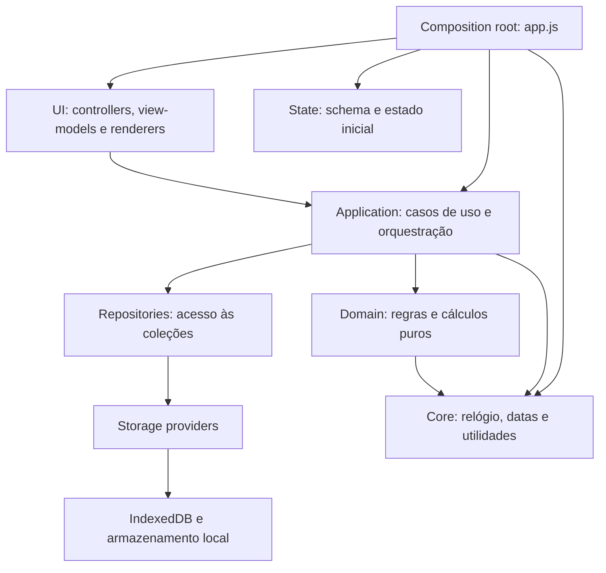
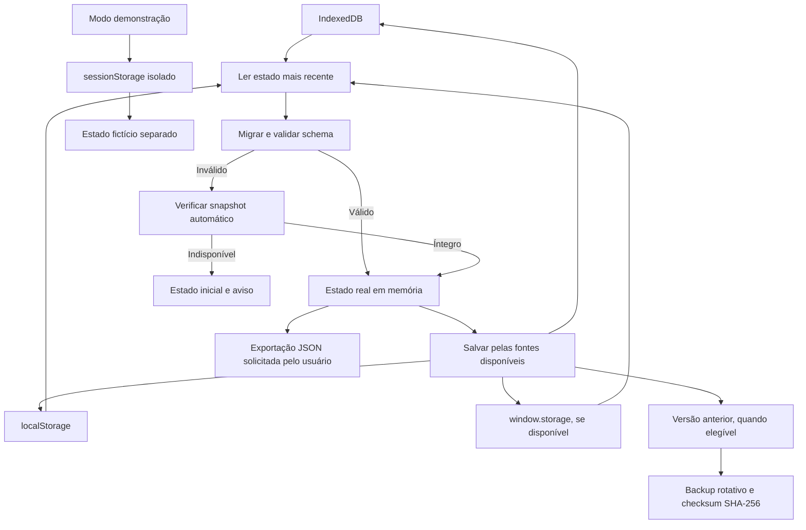

# Arquitetura

O aplicativo continua executando inteiramente no navegador e sem dependências externas de JavaScript.

## Visão geral da arquitetura

`src/app.js` compõe estado, relógio, serviços e interface. As setas indicam dependências permitidas: a interface aciona a aplicação; regras de domínio não importam a interface nem acessam o estado global. Repositórios e providers isolam a persistência.



## Persistência e proteção dos dados

No modo real, o gerenciador lê as fontes disponíveis e seleciona o estado com `updatedAt` mais recente. Antes de adotá-lo, a aplicação migra e valida o schema; se o estado principal for inválido, tenta um snapshot automático íntegro. Ao salvar, mantém cópias nas fontes disponíveis. O backup automático rotativo guarda uma versão anterior, quando elegível, com checksum SHA-256 quando a API criptográfica está disponível. A exportação JSON é uma ação separada do usuário.



## Estrutura

- `index.html`: marcação e pontos de montagem da interface.
- `styles/tokens.css`: cores, temas e tokens visuais.
- `src/ui/components/presentation.js` e `docs/UI-FOUNDATIONS.md`: renderização compartilhada de cabeçalhos, métricas e estados vazios, com o contrato de superfícies e espaçamento usado na migração gradual das telas.
- `styles/app.css`: layout e componentes.
- `src/theme-bootstrap.js`: aplica o tema antes da primeira pintura.
- `src/bootstrap/bootstrap-application.js`: executa a inicialização com contexto explícito e contenção de falhas.
- `src/bootstrap/register-lifecycle.js`: registra e permite desmontar eventos globais do ciclo de vida.
- `src/bootstrap.js`: reexportação temporária compatível do bootstrap modular.
- `src/application/create-app-context.js`: registra provider, relógio, repositórios e gerador de IDs injetáveis.
- `src/application/demo/demo-mode.js`: controla entrada, reinício e saída segura da demonstração.
- `src/state/schema.js`: contrato do estado, versões, enums e chaves de armazenamento.
- `src/state/defaults.js`: fábrica do estado inicial, sem compartilhar referências mutáveis.
- `src/state/strategic.js`: normalização do plano de prova, importância/esforço dos tópicos e versões dos algoritmos.
- `src/core/utils.js`: utilidades puras e validações primitivas.
- `src/core/clock.js`: relógio injetável para datas locais e instantes reproduzíveis.
- `src/storage/repository.js`: acesso a IndexedDB, `localStorage` e `window.storage`.
- `src/storage/storage-provider.js`: contrato dos providers, incluindo carga, gravação, remoção, exportação e importação.
- `src/storage/indexed-db-provider.js`: acesso isolado ao IndexedDB.
- `src/storage/local-storage-provider.js`: fallback contido para armazenamento local.
- `src/storage/real-storage-provider.js`: adaptação compatível da persistência real existente.
- `src/storage/demo-storage-provider.js`: persistência temporária e isolada em `sessionStorage`.
- `src/storage/migration-service.js`: execução ordenada e verificável das migrações de schema.
- `src/storage/backup-service.js`: serialização, leitura segura e nomes dos arquivos de backup.
- `src/repositories/collection-repository.js`: contrato uniforme de consulta e mutação das coleções do estado.
- `src/demo/demo-generator.js`: cenário determinístico móvel de 130 dias para exploração do produto.
- `src/domain/reviews.js`: regras puras de intervalos e revisões adaptativas.
- `src/domain/analytics/evidence.js`: contrato comum de amostra, período, confiança e fontes.
- `src/domain/analytics/score-evidence.js`: separa disponibilidade de dados, força da evidência e incerteza heurística.
- `src/domain/analytics/priority-score.js`: fórmula única de prioridade usada por recomendações e planejamento.
- `src/domain/analytics/topic-metrics.js`: métricas puras de domínio e retenção por tópico.
- `src/domain/analytics/review-health.js`: condição explicável da revisão a partir de recência, retenção, domínio, desempenho e impacto da prova.
- `src/domain/analytics/readiness-score.js`: composição ponderada do índice e de sua confiança.
- `src/domain/analytics/coverage.js`: cobertura de tópicos ativos.
- `src/domain/analytics/consistency.js`: sequência de atividade e cumprimento das metas diárias.
- `src/domain/analytics/trends.js`: comparação de janelas equivalentes de desempenho.
- `src/domain/analytics/study-metrics.js`: consolidação pura de sessões, questões e simulados.
- `src/domain/analytics/heatmap.js`: intensidade e níveis do mapa de atividade por indicador.
- `src/domain/analytics/multidimensional-radar.js`: eixos, confiança e interpretação do radar comparativo.
- `src/domain/diagnostics/cognitive-profile.js`: perfil de erros com amostra, período, cobertura e confiança.
- `src/domain/diagnostics/risk-score.js`: risco composto com pesos redistribuídos, confiança e contribuições auditáveis.
- `src/domain/forecasts/performance-forecast.js`: faixa atual, distância até a meta e projeção conservadora de 30 dias com requisitos mínimos de evidência.
- `src/application/build-executive-summary.js`: modelo de apresentação do resumo executivo sem acesso ao DOM.
- `src/application/generate-diagnosis.js`: classificação explicável de gargalos, oportunidades, riscos e foco semanal.
- `src/application/recommend-study.js`: priorização normalizada e limitada pelo tempo disponível.
- `src/application/build-study-candidates.js`: composição única dos candidatos, riscos, evidências e elegibilidade.
- `src/application/build-study-plan.js`: proposta semanal até a prova, limitada por carga e disponibilidade.
- `src/application/replan-study.js`: cálculo de déficit e proposta de redistribuição sem mutação automática do plano.
- `src/application/planning/distribute-study-plan.js`: distribuição confirmável do plano semanal, materialização diária e desfazer protegido por execução.
- `src/domain/study-eligibility.js`: sessões curtas, manutenção de tópicos concluídos e validação transitiva de pré-requisitos.
- `src/application/sessions/session-service.js`: ciclo de vida das sessões e sincronização de questões, planejamento, histórico e recomendações.
- `src/application/records/record-service.js`: operações normalizadas para calendário, questões, simulados e metas.
- `src/application/calendar/build-unified-reviews.js`: normaliza itens do Calendário e da Agenda de Revisões para indicadores e telas compartilhadas.
- `src/application/subjects/subject-service.js`: ciclo de vida de disciplinas e tópicos, incluindo arquivamento auditável.
- `src/repositories/subjects-repository.js`: acesso à coleção e às entidades aninhadas de tópicos.
- `src/application/recommendations/outcome-service.js`: linha de base, resultado e confiança das recomendações sem ajuste automático de pesos.
- `src/domain/recommendations/recommendation-outcome.js`: comparação imutável entre os estados anterior e posterior, com deltas, confiança e estados de resultado.
- `src/application/subjects/exam-import-service.js`: preview e importação atômica de estruturas de edital com merge idempotente.
- `src/domain/exams/exam-constants.js`: tags, fontes e versão leve do catálogo de editais, sem carregar a lista completa de tópicos.
- `src/domain/exams/exam-preset-options.js`: nomes dos editais usados nos primeiros passos da interface.
- `src/domain/exams/exam-catalog.js` e `src/domain/exams/exam-presets.js`: normalização, validação e estruturas completas de BB, Caixa e combinada.
- `src/domain/exams/exam-catalog-runtime.js`: entrada do bundle sob demanda que expõe as estruturas completas ao navegador.
- `src/domain/analytics/recommendation-calibration.js`: leitura agregada dos resultados reais sem ajuste automático de pesos.
- `src/domain/forecasts/performance-scenarios.js`: simulações conservadoras de capacidade sobre a projeção de 30 dias.
- `src/domain/analytics/exam-mastery-matrix.js`: matriz explicável de cobertura, domínio, retenção e lacunas por edital.
- `src/domain/recommendations/study-strategy.js`: estratégia versionada e etapas executáveis pelo cronômetro existente.
- `src/ui/view-models/` e `src/ui/renderers/`: Questões, Agenda/Revisões, Calendário, calibração e cenários mantêm preparação de dados e HTML fora do composition root.
- `src/ui/renderers/calendar-renderer.js`: indicadores, mês, opções de filtro e linhas do Calendário são renderizados fora de `src/app.js`.
- `src/ui/renderers/question-analytics-renderer.js`: cartões de resumo, desempenho por tópico, tendência semanal e filtros do perfil de erros são apresentados fora de `src/app.js`.
- `src/ui/renderers/questions-renderer.js`: linhas de leitura/edição e campos de categorização dos erros das Questões são apresentados fora de `src/app.js`.
- `src/ui/renderers/global-search-renderer.js`: resultados de comandos e tópicos da busca global são apresentados fora de `src/app.js`.
- `src/ui/renderers/heatmap-renderer.js`: controles, células, legenda e resumo do mapa de atividade são apresentados fora de `src/app.js`; o view-model continua fornecendo os níveis calculados.
- `src/ui/renderers/study-sessions-renderer.js`: linhas de leitura e edição e cabeçalhos diários do histórico de sessões são apresentados fora de `src/app.js`.
- `src/ui/renderers/study-charts-renderer.js`: SVGs de evolução de progresso/horas e barras de tempo por disciplina são gerados fora de `src/app.js`.
- `src/ui/renderers/overview-renderer.js`: alertas da Visão Geral e cartões do resumo executivo são apresentados fora de `src/app.js`.
- `src/ui/renderers/diagnosis-renderer.js`: centro de diagnóstico, sinais, evidências e ações recomendadas são apresentados a partir do view-model sem montar HTML no `src/app.js`.
- `src/domain/diagnostics/` e `src/application/diagnostics/`: contrato, vocabulário e precedência dos sinais; consolidação por entidade; seleção contextual da próxima ação; dívida de revisão. A ordem e a elegibilidade continuam no motor de recomendações.
- `src/application/performance/` e `src/ui/performance/`: período, escopo e modelos das cinco visões de Desempenho, com renderização separada da raiz de composição.
- `src/application/navigation/analysis-context.js`: contexto transitório de origem, concurso, disciplina, tópico e período para navegar entre análises sem mudar o schema.
- `src/application/analytics/group-strategic-timeline.js`: agrupamento dos eventos existentes por semana, mês ou fase registrada; a lista usa uma paginação progressiva global.
- `src/application/goals/update-subject-accuracy-targets.js`: atualização em lote das metas de acerto por disciplina, com `null` indicando herança da meta global.
- `src/application/diagnostics/build-diagnosis-page-model.js`: coordena sinais, diagnóstico consolidado, próxima ação e dívida de revisão sem gerar HTML.
- `src/application/performance/build-performance-page-model.js`: monta o modelo da visão selecionada a partir de registros já filtrados; `src/ui/performance/render-performance-section.js` escolhe o renderer correspondente.
- `src/ui/controllers/performance-controller.js` e `src/ui/controllers/diagnosis-controller.js`: eventos de navegação e prévia específicos dessas áreas.
- `src/application/readiness/build-readiness-change-explanation.js`: apresenta a comparação dos snapshots salvos quando algoritmo, pesos e fatores coincidem; não reconstrói valores históricos.
- `src/ui/renderers/retention-renderer.js`: filtros, padrões e linhas do painel de retenção são apresentados fora de `src/app.js`.
- `src/ui/renderers/simulations-renderer.js`: linhas e edição de simulados, detalhamento por disciplina, gráfico de evolução e tabela comparativa são apresentados fora de `src/app.js`.
- `src/application/alert-lifecycle.js`: ordenação, limitação, dispensa temporária e resolução de alertas.
- `src/ui/accessibility.js`: rotulagem dinâmica e controle de foco em modais.
- `src/ui/controllers/navigation-controller.js`: abas, menu móvel, atalhos numéricos, busca e fechamento por Escape.
- `src/ui/controllers/modal-controller.js`: confirmações e prompts acessíveis com validação e restauração de foco.
- `src/ui/controllers/editable-collection-controller.js`: estado de rascunho e ciclo de edição dos registros operacionais.
- `src/ui/controllers/preferences-controller.js`: tema visual e persistência das preferências locais.
- `src/ui/controllers/backup-controller.js`: leitura, exportação e importação de arquivos de backup no navegador.
- `src/ui/controllers/delegated-events-controller.js`: roteamento seguro das ações declarativas da interface sem funções globais.
- `src/ui/renderers/application-renderer.js`: composição resiliente e seletiva das seções visuais.
- `src/application/goals/goal-service.js`: regras de metas globais e disponibilidade diária.
- `src/application/subjects/structured-content-import.js`: interpretação validada de JSON/CSV, diagnóstico agregado por linha e mesclagem transacional por nomes normalizados. O serviço distingue campos vindos da importação de ajustes manuais e preserva estes últimos.
- `src/features/structured-import/`: controlador, view-model e renderer do fluxo de prévia e confirmação. O estado pendente permanece somente na interface até a confirmação explícita.
- `src/application/analytics/build-overview-view-model.js`: composição das métricas de tempo da Visão Geral sem dependência do DOM.
- `src/core/date-utils.js`: interpretação, formatação e intervalos de datas civis locais usados pela aplicação e pelos view-models.
- `src/domain/analytics/topic-strategy.js`: resolução única do impacto efetivo do tópico e validação de ciclos entre pré-requisitos.
- `src/features/topic-strategy/`: view-model, renderer e controller dos campos de impacto, esforço e pré-requisitos dos tópicos.
- `src/repositories/settings-repository.js`: alterações controladas das metas e configurações persistentes.
- `src/ui/list-components.js`: cabeçalhos agrupados e rodapés paginados reutilizáveis.
- `src/ui/filter-panel.js`: contagem e rótulos puros dos filtros responsivos.
- `src/ui/session-history.js`: filtragem e agrupamento puro do histórico de sessões.
- `src/reports/report-data.js`: snapshot estratégico filtrado por período e independente da interface.
- `src/reports/weekly-focus-summary.js`: recorte dos últimos sete dias do período, com o mesmo cálculo de foco do fechamento semanal.
- `src/reports/report-template.js`: template seguro do relatório A4.
- `src/reports/print-report.js`: coordenação isolada da impressão/“Salvar como PDF”.
- `src/ui/controllers/report-controller.js`: eventos e composição do relatório, com estado e cálculos recebidos da raiz.
- `src/ui/help/`: conteúdo da Central de Ajuda, renderer e controlador de busca e navegação; `app.js` apenas monta o recurso e fornece a navegação entre abas.
- `docs/VISUAL-HIERARCHY.md`: mapa de decisão, análise e evidência para orientar mudanças visuais sem alterar os cálculos.
- `src/app.js`: raiz de composição, compatibilidade dos fluxos legados e registro explícito das dependências.
- `src/app.bundle.js`: artefato gerado para permitir abertura direta por `file://`.
- `service-worker.template.js`: fonte do service worker; `service-worker.js` é gerado com a versão do cache.
- `styles/print.css`: apresentação A4 do relatório exportado pela impressão do navegador.

## Fluxo de dependências

`app.js` pode importar `state`, `core`, `storage` e `domain`. Os módulos inferiores não devem importar a interface nem acessar o estado global da aplicação.

Na jornada estratégica, os modelos de Desempenho leem registros do concurso ativo; o Diagnóstico consolida sinais por entidade e apresenta uma recomendação já elegível. A prévia usa o planejamento existente e permanece transitória até a confirmação. A sessão vinculada e o fechamento são persistidos pelos fluxos atuais. Snapshots históricos ficam congelados; o renderer não recalcula o passado.

## Build e verificações

Após alterar fontes, estilos ou assets, execute no PowerShell:

```powershell
npm install
npm run build
npm run check
```

`src/app.bundle.js`, `src/exam-catalog.bundle.js`, `index.html` e `service-worker.js` são artefatos gerados e não devem ser editados para alterar suas versões manualmente. O build calcula um fingerprint determinístico dos fontes e assets, aplica o mesmo valor às URLs versionadas e ao nome do cache PWA, e injeta essa versão no carregamento sob demanda do catálogo. A implantação no GitHub Pages executa `npm ci` e `npm run build` antes de preparar o site. `npm run check:bundle` verifica a reprodução dos bundles e dos arquivos versionados. O bundle principal não incorpora os dados completos do catálogo; o segundo bundle é carregado ao abrir o assistente ou o importador. `build.ps1` é um atalho para `npm run build`.

## Persistência

IndexedDB é usado em conjunto com armazenamento local. Cada estado recebe `updatedAt`; o mais recente é carregado. Backups automáticos rotativos possuem checksum SHA-256. Antes de adotar dados locais ou importados, a aplicação migra e valida toda a estrutura. Abas abertas trocam versões por `BroadcastChannel`.

O schema 28 inclui `examBlueprint`, versões dos algoritmos, campos estratégicos dos tópicos, modo demonstrativo, vínculos auditáveis do planejamento, evidências e resultados das recomendações, estado individual da revisão adaptativa, normalização das sessões, snapshots do escopo de evidências históricas, histórico das decisões de redistribuição semanal, ciclo de vida das recomendações exibidas, coleções independentes de provas e questões históricas, `readinessSnapshots`, a meta configurável `metas.consistenciaSemanal` e snapshots de trajetória. Dados ausentes são mantidos em estado neutro (`null`) quando aplicável e backups anteriores continuam sendo migrados automaticamente pelas migrações sequenciais até a versão atual.

O schema 24 preserva por prova o total conhecido de questões, o total oficial opcional e as linhas ignoradas ainda sem classificação. A migração de provas antigas não inventa esses números: a cobertura permanece indisponível até nova importação. Provas declaradas completas mas com pendências ou total conhecido inferior ao declarado passam a parciais, evitando que lacunas de mapeamento pareçam ausência do tópico na prova.

`readinessSnapshots` guarda o índice, os fatores, a confiança, o concurso ativo e a versão do cálculo na data em que o fechamento semanal é salvo. Um novo fechamento não reescreve a prontidão já capturada para a mesma data e o mesmo escopo. A migração de v24 para v25 cria a coleção vazia, sem reconstruir índices passados com dados atuais. Novos registros usam a versão 2 do snapshot, com pesos, motivo, tipo de captura e identidade do evento. Fechamentos continuam únicos por data e escopo; eventos anteriores a mudanças estratégicas podem coexistir no mesmo dia sem sobrescrever o fechamento. A migração v25 → v26 acrescenta `projectionSnapshots`, inicialmente vazio. Faixas emitidas preservam valores, composição, escopo e entradas anteriores; apenas simulados em dias posteriores podem validar a faixa.

`src/application/projection/` compõe a calibração de simulados e a tendência de 30 dias em um estado de trajetória explicável. A mesma coleção `projectionSnapshots` guarda registros `kind: "achievement"` com entradas, escopo, versão e resultado congelados; a calibração retrospectiva ignora esse tipo. Desempenho mostra observações e tendência como trechos distintos e nunca apresenta nota projetada para o dia da prova ou probabilidade de aprovação. O contrato detalhado está em `docs/projecao-atingimento-contrato.md`.

A versão 2 da trajetória reutiliza candidatos da prioridade existente apenas para identificar lacunas medidas de alto impacto. A Inteligência da Prova e a Próxima Melhor Ação exibem esse contexto sem recalcular a ordem das recomendações. O Fechamento Semanal compara a trajetória atual com um snapshot anterior do mesmo escopo, meta, data de prova e versão. A interpretação temporal usa as fases do planejamento adaptativo. O Recovery reutiliza o motor adaptativo para oferecer uma redistribuição com capacidade preservada, sujeita a prévia, confirmação e revalidação.

`recovery-controller.js` coordena prévia, aplicação e reversão. `application/recovery/recovery-invariants.js` confere as alocações reais: carga semanal invariável, transferência exata entre duas disciplinas, mistura de atividades válida e preservação dos demais itens. A prévia captura também metas, configuração estratégica e data da prova; alterações exigem nova confirmação. `apply-recovery-plan.js` prepara plano, auditoria e snapshot em uma cópia do estado. O serviço de confirmação existente recebe um repositório dessa cópia, nunca o estado publicado.

`recovery-state-committer.js` grava o estado completo em uma operação serializada antes de publicá-lo em memória. A aplicação coordena essa operação com a fila existente de saves; saves anteriores terminam primeiro e saves novos aguardam a operação. Uma edição durante a gravação cancela o Recovery e tenta restaurar o estado atual no armazenamento. Falhas de gravação preservam o estado em memória e são informadas ao usuário. O sucesso segue o contrato do storage provider: ao menos um backend confirmou a gravação. Não há transação distribuída entre IndexedDB e os outros backends; falha na restauração é informada com orientação para exportar backup.

`revert-recovery-plan.js` restaura as alocações em uma nova versão, somente se o plano aplicado ainda for o ativo e suas alocações corresponderem à decisão. Sessões, questões, planos diários e versões anteriores permanecem intactos. A decisão recebe `revertedAt`, `revertReason`, `originalDecisionId` e `reversionPlanId`, preservando a explicação original. A Timeline apresenta aplicação e reversão como eventos distintos. Os testes cobrem falhas em cada estágio, edição concorrente, confirmação duplicada, Demo e reversão após execução real.

O planejador adaptativo versão 5 usa identidades estáveis para desempatar disciplinas e itens. Aplicações e reversões protegem o mesmo par de disciplinas durante o cooldown; a data é interpretada no calendário local. A exceção por deterioração exige uma nova queda de pelo menos 12 pontos em relação ao domínio congelado na decisão anterior, com evidência forte. Histórico sem essa medida não autoriza a exceção. A reversão não libera uma reaplicação imediata.

`ui/performance/recovery-plan-renderer.js` apresenta primeiro as duas alocações alteradas e o total preservado. As disciplinas preservadas ficam recolhidas, com cinco itens iniciais e Mostrar mais. Durações são exibidas em horas e minutos exatos; a confirmação lista apenas alterações. A Trajetória mantém evidência e ação como interpretação principal, sem repetir resultado e prazo em outros cards. Os testes visuais cobrem desktop, mobile, claro/escuro e cancelamento por teclado; cancelar não modifica o estado.

`build-readiness-evolution.js` compara apenas registros do mesmo escopo, algoritmo, pesos e fatores disponíveis. A mudança de base interrompe a linha e recebe uma explicação. As contribuições dos fatores são ponderadas; a soma pode diferir ligeiramente do delta inteiro por arredondamento. Registros legados da versão 1 usam os pesos conhecidos do algoritmo 1.

A revisão manual de uma classificação registra método, confiança e instante de revisão na questão histórica. Questões pendentes são removidas da lista de pendências quando associadas a um tópico; se a cobertura originalmente declarada era completa e o total se tornou consistente, a prova volta a contar como completa. Reimportações preservam a classificação manual, sem tocar em `questoes`, sessões ou snapshots anteriores de recomendações.

`exams` e `examQuestions` guardam evidências de provas, separadas de `questoes`, que registra o desempenho pessoal. Cada prova tem instituição, nome, cargo, banca, ano, origem, referência, tags de escopo e cobertura (`unknown`, `partial` ou `complete`). A cobertura evita tratar uma prova incompleta como ausência de um tópico. Cada questão histórica aponta para uma prova e um tópico existentes e registra número, peso opcional, origem e método/confiança da classificação. A migração de v22 para v23 cria as coleções vazias; não infere questões históricas dos registros pessoais.

A incidência histórica usa apenas provas com cobertura `complete` dentro do concurso ativo. **Presença** é a quantidade de provas completas com o tópico dividida pela quantidade de provas completas; **participação** é a quantidade de questões classificadas no tópico dividida pelas questões classificadas nessas provas. Provas parciais entram somente na contagem de questões observadas. A recência informa quantas das três provas completas mais recentes contêm o tópico, sem alterar o score. Uma prova produz confiança `insufficient`; 2–3, `low`; 4–7, `moderate`; 8 ou mais, `high`, com redução quando a classificação das questões é fraca. Ausência de histórico mantém os percentuais nulos.

O perfil de impacto reúne o valor configurado e a evidência histórica. A origem do valor é `manual`, `estimated` (catálogo) ou `official` somente quando o peso da disciplina tem referência oficial. Incidência e peso observado em questões são `historical`, com confiança própria. Com pelo menos quatro provas completas e confiança moderada ou alta, presença e participação ajustam conservadoramente o `examImpact` estimado, limitando a variação a 15 pontos. Valores manuais e oficiais permanecem intactos. O motor de prioridade mantém os pesos e recebe apenas o impacto validado; a explicação da recomendação separa Prova, Você e Ação.

A auditoria de configuração calcula a estimativa histórica com a mesma fórmula usada na validação do impacto. Só classifica divergência quando a amostra histórica é utilizável; os limiares de 10 e 20 pontos servem à apresentação, sem modificar prioridade. O detalhe da matriz mostra separadamente impacto configurado, estimativa histórica e impacto efetivo. Quando o valor vem de peso oficial da disciplina, o indicador de 0 a 100 é identificado como *derivado* desse peso, e nunca apresentado como pontos oficiais por questão.

`src/application/exam-intelligence/import-exam-json.js` valida um JSON de prova e questões, gera prévia por correspondência normalizada e calcula um merge atômico. Cada disciplina ou tópico sem correspondência exige associação explícita, criação explícita de tópico ou descarte. Identidades estáveis para prova e número da questão impedem duplicatas na reimportação. A importação histórica usa coleções separadas do desempenho pessoal; quando o arquivo não contém tags, o concurso ativo é adotado como escopo. `src/features/exam-intelligence-import/` mantém o estado transitório, coleta decisões da prévia e controla arquivo, cancelamento e confirmação; `app.js` apenas fornece o estado e persiste o resultado.

`src/application/exam-intelligence/build-exam-matrix.js` monta a matriz histórica por tópico e prova, com filtros de concurso, banca, ano, cargo e disciplina, busca e ordenação. Somente provas completas aparecem como colunas e entram no denominador; a célula guarda a quantidade de questões e o peso somado, quando informado. O renderer alterna histórico e prioridades, oferece tabela em telas largas, cards no celular e detalhamento Prova × Você com incidência, confiança e indicadores pessoais. A cor do mapa não substitui a contagem textual.

Os limites compartilhados da inteligência histórica e da adaptação V4 ficam em `src/domain/exam-intelligence/config.js`. Exam Intelligence V1, Priority Engine V5 e Adaptive Planning V4 têm versões independentes. Novos registros de recomendação e seus snapshots guardam a versão da prioridade e da inteligência da prova que produziram a decisão. A massa de validação e a tabela de decisões estão em `docs/EXAM-INTELLIGENCE-VALIDATION.md`.

Os significados transversais de alto impacto (70/100), domínio adequado (70/100), evidência suficiente (0,5) e mínimo histórico (4 provas) ficam em `src/domain/strategy/config.js`. PDF, foco semanal, conquistas, alertas e planejamento usam o limite correspondente sem recalibrar o Priority Engine. Outros números iguais, como confiança da classificação de uma questão, mantêm regras próprias quando medem conceitos diferentes.

`src/reports/exam-report-summary.js` seleciona os indicadores da prova e limita a três as lacunas no PDF. O PDF também resume os últimos sete dias do período selecionado, com minutos planejados e executados e o mesmo cálculo de foco usado na interface; ele não exporta a matriz histórica completa. `src/application/analytics/build-weekly-strategic-focus.js` calcula a fração do tempo em tópicos de alto impacto e só classifica melhora/estabilidade quando existe resultado posterior medido no período. O fechamento semanal usa a versão 2.2.0 e o snapshot preserva o bloco calculado e o escopo do concurso ativo. `src/application/analytics/build-strategic-focus-history.js` compara apenas períodos salvos, completos e sem sobreposição do mesmo escopo. `src/application/achievements/build-strategic-achievements.js` avalia três conquistas por evidência de estudo, domínio ou provas completas, sem alterar o algoritmo de prioridade.

`recommendationHistory` guarda cada recomendação visível uma vez por identidade de apresentação, com estados pendente, executada, recusada ou expirada. O registro aponta para `recommendationFeedback` quando há decisão e para a sessão quando ela é salva. A migração cria registros apenas para decisões antigas conhecidas; ela não inventa recomendações pendentes anteriores. O resumo dos últimos 30 dias usa esse histórico e conta cada identidade uma vez.

O planejamento adaptativo registra somente decisões explícitas. A prévia calculada não entra no histórico. Transferências propostas ficam entre 15 e 40 minutos por semana, respeitando o orçamento semanal e a manutenção dos tópicos de origem. Outro ajuste entre as mesmas disciplinas aguarda 14 dias após uma aplicação, exceto quando a disciplina de destino apresenta queda relevante com evidência forte. Sem mudança justificada, a interface informa que o plano continua adequado.

No planejamento orientado à prova, os candidatos já trazem o `examImpact` validado pelo histórico. A adaptação V4 ordena destinos pela combinação de impacto e lacuna de domínio, exige necessidade mínima e evita retirar tempo de uma disciplina consolidada com impacto superior ao destino. Quando o impacto incorpora histórico confiável, a prévia e a justificativa citam presença, amostra e confiança. O cooldown de 14 dias protege o mesmo par de disciplinas em qualquer direção após um ajuste confirmado; uma nova importação não aplica transferências automaticamente. A exceção continua restrita à deterioração relevante com evidência forte.

## Contrato de ação de estudo

`buildStudyAction` em `src/application/recommendations/recommendation-action.js` é a entrada única para transformar uma recomendação em `StudyAction`. Visão Geral, Hoje e Diagnóstico usam essa função e entregam `id` e `source` ao mesmo `recommendationController.execute`; Estudo Guiado recebe o contexto daí. Uma área nova não deve montar outra estrutura de ação.

| Campo | Contrato | Destino |
| --- | --- | --- |
| `id` | Obrigatório; identifica o item acionável na lista atual. | Transitório; usado para localizar e revalidar a recomendação ao executar. |
| `source` | Obrigatório; `overview`, `today`, `diagnosis`, `planning` ou `review`. | Registrado como `recommendationSource` na sessão e origem da apresentação no feedback. |
| `subjectId`, `topicId` | Referências do alvo; podem ser `null` quando a recomendação não tem esse nível de detalhe. | Persistidos na sessão; servem de chave para a evidência recalculada. |
| `activityType` | Obrigatório; derivado de atividade, pré-requisito ou tipo de estudo (`study`, `questions`, `review`, `prerequisite`). | Persistido como `recommendationType`; o tipo efetivamente executado também fica em `session.type`. |
| `suggestedMinutes`, `priority` | Números finitos ou `null`; são estimativas no momento da recomendação. | Transitórios na ação; o cronômetro guarda a meta e a sessão guarda a duração real. |
| `reasons`, `evidence` | Lista de motivos e retrato analítico; métricas ausentes permanecem `null`. | Usados na apresentação e no snapshot do feedback, sem substituir a evidência medida depois da sessão. |
| `recommendationId`, `algorithmVersion` | O primeiro é opcional até a apresentação receber um ID; a versão pode ser `null`. | O ID vincula sessão e feedback; a versão permite interpretar o snapshot histórico. |

O objeto retornado é imutável. Ao clicar, o controlador revalida o candidato antes de iniciar a ação. A conclusão registra sessão e resultado, atualiza questões/revisões quando aplicável, mede a nova evidência e recalcula as recomendações. O próximo `StudyAction` é derivado do estado atualizado; `id` e `priority` anteriores não são reutilizados como verdade persistida.

O Índice de Prontidão usa cobertura (30%), domínio (25%), retenção (20%), consistência (15%) e simulados (10%). Pesos de fatores indisponíveis são redistribuídos entre as evidências existentes; a ausência reduz a confiança, mas não produz nota zero.

## Auditoria final da modularização

- A interface não publica controladores no escopo global; a única exceção é `window.__EXTRATO_TEST__`, criada apenas com `?test=1` para a suíte legada.
- Eventos declarativos aceitam somente handlers registrados e argumentos previamente permitidos.
- Renderizadores de alto nível isolam falhas por seção, evitando que um cartão interrompa toda a tela.
- Alterações de metas, disciplinas, sessões, revisões, planejamento e registros operacionais passam por serviços e repositórios.
- Acesso técnico a IndexedDB, `localStorage`, `sessionStorage`, arquivos e impressão está contido em providers ou controladores de infraestrutura.
- `app.bundle.js` continua sendo artefato gerado; a fonte de verdade permanece nos módulos de `src/`.
## Ciclo de estabilização

O Calendário mantém navegação e edição em `calendar-controller.js`; a composição da raiz injeta estado e serviços, enquanto `build-unified-reviews.js` prepara os itens compartilhados e `calendar-renderer.js` gera a apresentação sem persistência.

O contrato de `report-data.js` resolve nomes e estados antes da impressão; `report-template.js` nunca usa IDs internos como texto visível. O fechamento semanal versionado recebe os dois períodos da camada de aplicação e devolve deltas tipados, diagnóstico e ação recomendada.

O ciclo analítico 3.2 é preparado por um view-model sem DOM e entregue a renderizadores independentes. O composition root conecta os controladores de Calendário e Questões, a fachada de importação do edital e o serviço de estudo guiado aos fluxos reais da interface; módulos de domínio continuam responsáveis pelos cálculos e pela persistência coordenada.

No primeiro uso, catálogo de edital, importação JSON/CSV e cadastro manual alimentam o mesmo modelo de conteúdo e a mesma proposta de planejamento. O onboarding suspende seu diálogo durante a importação, restaura a etapa de origem ao cancelar e apresenta a prévia somente quando há conteúdo; a confirmação exige atividades elegíveis. A importação estruturada reutiliza seu parser, prévia e serviço transacional existentes.
# Escopo analítico por concurso

`src/domain/exams/exam-scope.js` é a única autoridade para elegibilidade de conteúdo. `resolveExamScope` separa tópicos elegíveis, pessoais, catalogados e excluídos. `src/domain/exams/exam-evidence-scope.js` classifica registros históricos como `topic_scoped`, `subject_only` ou `unscoped` e impede que evidência sem tópico seja atribuída a um edital específico.

| Família | Exemplos | Regra |
| --- | --- | --- |
| Estritamente filtrável | cobertura, domínio, retenção, gap, prioridade e revisões por tópico | usa tópicos elegíveis |
| Parcialmente filtrável | tempo, sessões, questões e erros | exige tópico elegível para métricas específicas; registros só da disciplina permanecem gerais |
| Global | tempo histórico total e quantidade patrimonial de sessões | não muda ao trocar o concurso |

Consumidores de planejamento, candidatos, matriz Edital × Domínio, prontidão, alertas, forecast, fechamento semanal e PDF recebem conteúdo ou evidência já resolvidos pelo contrato de escopo. O PDF apresenta separadamente valores atribuídos ao edital e registros sem tópico elegível.

Trocas em `activeExamTags` passam por `src/application/exams/exam-scope-transition.js`, que invalida derivados persistidos. O importador mantém estado, ações e view-model em `src/features/exam-import/`; a camada de aplicação continua responsável pelo serviço e pela persistência.

O relógio separa o instante UTC da data civil local. A CI executa testes unitários e reprodução do bundle em `UTC` e `America/Sao_Paulo`; o E2E completo roda em UTC e um conjunto de jornadas sensíveis a datas roda em São Paulo. Esses jobs são paralelos. `npm run check:all` continua sendo o gate local completo.
## Prontidão dos testes E2E

Os helpers em `tests/e2e/helpers/app-state.js` centralizam quatro estados observáveis: aplicação pronta, importador pronto, estado persistido e renderização estável. Testes devem aguardar esses estados em vez de usar atrasos temporais. Elementos críticos do wizard usam `data-testid`; falhas retêm trace, screenshot e vídeo.

## Fluxo do Edital Inteligente

```text
DOM event → controller → action → state → view-model → renderer
```

`exam-import-state.js` é a autoridade da seleção. O controller apenas orquestra eventos; `exam-import-view-model.js` entrega `visibleSubjects`, contadores e estados `checked`/`indeterminate`; o renderer recebe esse contrato sem acessar o estado global.

## Transição de escopo

Toda mudança de concursos ativos passa por `setActiveExamTags()`. As tags são deduplicadas e ordenadas antes da comparação, e somente campos derivados do edital são invalidados. Sessões, questões, revisões e histórico nunca são apagados pela troca de escopo.

## Prioridade registrada no plano

Cada novo item confirmado registra prioritySnapshot, com score, fatores, razões, evidência, algoritmo e política de classificação. A política 1 classifica score ≥ 70 como prioritário; prioridades aceitas explicitamente no fechamento também são identificadas. Ausência de score não significa baixa prioridade. A distribuição diária copia o contexto do plano semanal e as sessões vinculadas recebem planPrioritySnapshot. Planos antigos permanecem sem classificação histórica, sem inferência a partir do diagnóstico atual.

## Explicações e consequências das decisões

### Execução diária compartilhada

O modelo em `application/daily-execution` consome planos e sessões existentes, o catálogo e a Próxima Melhor Ação. Crédito de atividade exige vínculo e compatibilidade de disciplina, tópico e tipo; tempo adicional permanece distinto. O card Hoje na Visão Geral e o resumo na aba Hoje usam esse modelo. `daily-execution-controller` revalida o contexto antes de iniciar pelo fluxo de cronômetro existente. Editar ou excluir sessões recalcula o crédito, sem reescrever registros históricos.

A leitura global do card não registra recomendações como apresentadas. O histórico continua pertencendo aos fluxos de apresentação e decisão existentes; restaurar um backup não fabrica decisões ao atualizar um card oculto. A data local é verificada ao retomar a janela e a cada minuto. O dia não é regenerado silenciosamente após Recovery; atividades da versão semanal anterior são sinalizadas para revisão. Consulte [Recovery e execução diária](docs/RECOVERY-EXECUTION.md).

build-recommendation-explanation.js fornece ação, razões, evidências e consequências operacionais. As apresentações guardam sua explicação original; a decisão guarda explanationSnapshot, evidenceSnapshot, suggestedAction e expectedImpact junto ao algoritmo e instante. Histórico de decisões e adaptações renderizam os valores capturados, sem consultar métricas atuais. Consequências descrevem cronômetro, revisão, vínculo ao plano e redistribuição confirmável; não são previsão de ganho de domínio, prontidão ou nota. Registros legados sem explicação detalhada não recebem uma reconstrução retroativa.

### Metas pessoais e sinais de preparação

`metas.consistenciaSemanal` guarda apenas o alvo de 1 a 7 dias, com padrão de 5. O resultado semanal é derivado das datas locais distintas das sessões de estudo com duração positiva, de segunda-feira até hoje. A mesma contagem de dias válidos alimenta Desempenho → Consistência no período selecionado; sessões múltiplas no mesmo dia contam uma vez. A migração 26 → 27 acrescenta o alvo sem reconstruir histórico.

A meta opcional `examBlueprint.subjects[].accuracyTarget` herda a meta global de acerto. É independente de `masteryTarget`, pesos e incidência. Os fechamentos e perfis de prioridade preservam a meta registrada. Não há migração retroativa desses indicadores.

`buildPreparationSignals` agrega questões e sessões do escopo ativo para apresentar possível platô e consolidação em risco. São sinais descritivos, sem redistribuição automática. O custo de oportunidade deriva da mesma proposta de planejamento adaptativo, preservando seus limites, cooldown e confirmação.
