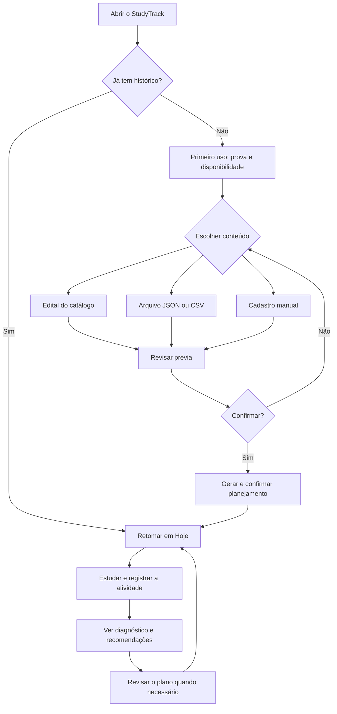
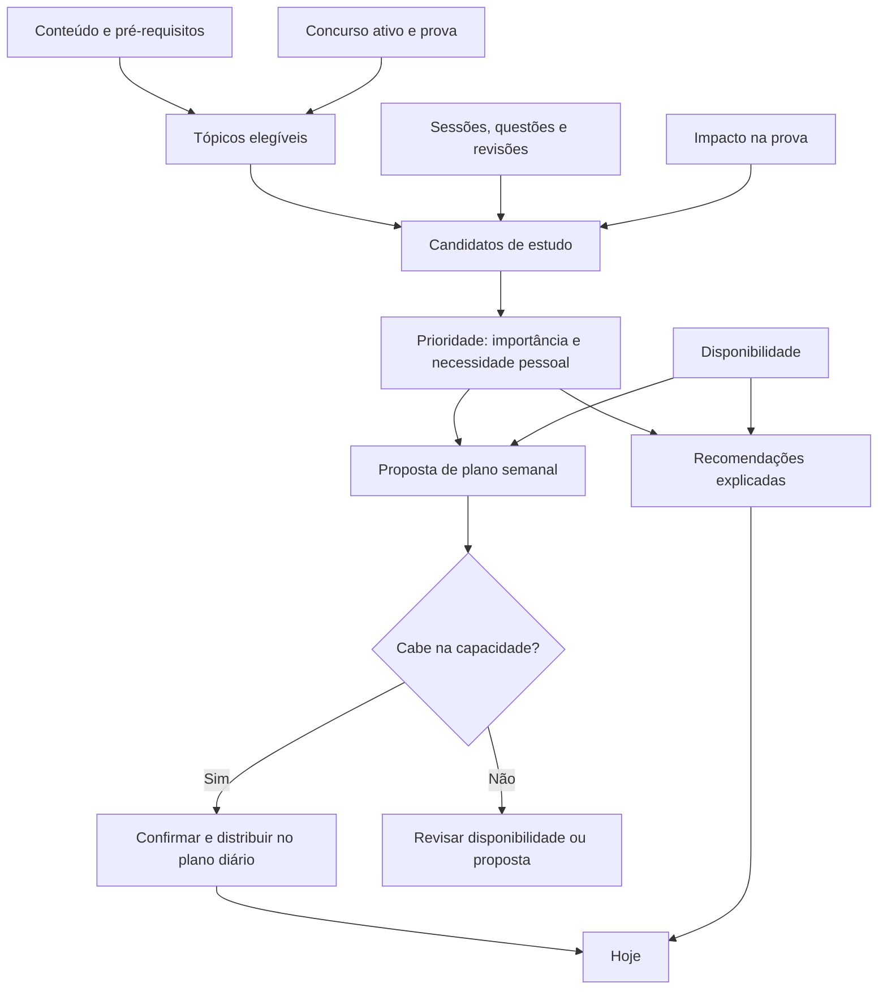
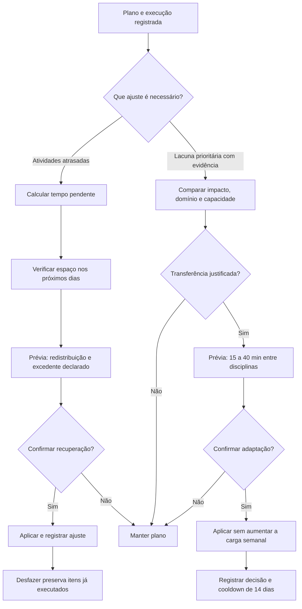

# StudyTrack — Extrato de Estudos

[Experimentar o StudyTrack](https://vitoriapac.github.io/Extrato/)

StudyTrack é uma aplicação web para planejar estudos, registrar sessões, organizar revisões e transformar o histórico em recomendações explicáveis. Funciona integralmente no navegador e pode ser instalada como PWA.

## Funcionalidades

- Disciplinas e tópicos com dificuldade, importância para a prova, esforço e pré-requisitos.
- Planejamento semanal e diário baseado na disponibilidade, necessidade e saldo de capacidade.
- Cronômetro, histórico de sessões, questões e simulados.
- Revisões espaçadas, agenda, calendário e replanejamento.
- Índice de prontidão, retenção, domínio, tendências e projeção por faixa.
- Diagnóstico de erros e alertas com motivo e ação recomendada.
- Resultado mensurável das recomendações, comparando métricas antes e depois.
- Relatório estratégico em PDF e backup completo em JSON.
- Modo demonstração isolado com 130 dias de dados fictícios.
- Tema claro/escuro, layout responsivo e navegação por teclado.

## Como o StudyTrack funciona

Quem já tem dados salvos retoma o estudo sem repetir o primeiro uso. Para começar, os três caminhos de conteúdo levam a uma prévia; importar ou gerar um plano só altera os dados depois da confirmação.



## Como o planejamento decide o que estudar

O conteúdo elegível no concurso ativo, a disponibilidade e as evidências pessoais alimentam candidatos de estudo. A importância para a prova é combinada com a necessidade do estudante; o histórico da prova só ajusta o impacto estimado quando tem confiança suficiente. O mesmo cálculo de prioridade orienta recomendações e propostas de plano, respeitando a capacidade disponível.



## Como funciona o planejamento adaptativo

Há dois ajustes distintos. **Recuperação de atrasos** redistribui atividades pendentes nos dias com espaço; no cenário de três faltas, a parte que não cabe aparece como excedente, sem criar uma agenda impossível. **Adaptação semanal** propõe mover de 15 a 40 minutos de uma disciplina consolidada para outra com lacuna e impacto relevantes, sem aumentar a carga semanal. Ambos mostram uma prévia e exigem confirmação. O cooldown de 14 dias vale para o par de disciplinas após uma adaptação aplicada.



## Uso

Acesse a [demo online](https://vitoriapac.github.io/Extrato/) e selecione **Explorar demonstração** para conhecer o fluxo sem alterar seus dados. Para uso pessoal, saia da demonstração e cadastre a data da prova, a disponibilidade semanal, as disciplinas e os tópicos.

No assistente inicial, você pode carregar um edital do catálogo, importar um arquivo JSON/CSV ou cadastrar conteúdo manualmente. Os três caminhos retornam à mesma configuração e usam a proposta real do planejamento. Se nenhuma atividade estiver elegível, a confirmação fica bloqueada até revisar o esforço, os pré-requisitos ou a disponibilidade.

Os dados ficam no navegador. Exporte um backup JSON regularmente pela área de dados. A importação valida o formato e a versão antes de substituir o estado local.

Na área **Disciplinas**, a opção **Importar JSON ou CSV** abre uma prévia antes de alterar a base. Ela discrimina itens novos, existentes, atualizações e campos preservados; IDs, progresso, sessões, revisões, histórico e ajustes manuais não são sobrescritos. A mesma importação pode ser repetida sem criar duplicatas. O botão **Baixar modelo CSV** fornece um arquivo inicial com as colunas `disciplina`, `topico`, `dificuldade`, `importancia`, `esforco` e `tags`; somente as duas primeiras são obrigatórias. No JSON, use `subjects: [{ name, topics: [{ name }] }]`. A importância é informada de 0 a 100, o esforço em minutos e múltiplas tags são separadas por `|`.

Na área **Metas → Inteligência da prova**, importe provas históricas com JSON no formato `{"exam":{"institution":"Banco do Brasil","role":"Escriturário","board":"Cesgranrio","year":2023,"coverage":"complete"},"questions":[{"number":1,"subject":"Matemática","topic":"Juros Compostos","weight":1}]}`. A cobertura padrão é parcial; declare `complete` somente quando o arquivo representa toda a prova. A prévia exige decidir cada questão sem correspondência antes de confirmar. Reimportar a mesma prova atualiza questões sem duplicá-las. Com histórico suficiente, a evidência ajusta de forma limitada o impacto estimado; pesos oficiais e ajustes manuais são preservados.

A **Matriz histórica**, na mesma área, mostra quantas questões de cada tópico apareceram em cada prova completa. Filtre por concurso, banca, ano e cargo; selecione um tópico para ver incidência, confiança, peso registrado e sua situação de domínio e retenção. No celular, a matriz aparece em cards. Provas parciais ficam fora do denominador de incidência.

O **planejamento adaptativo** usa o impacto validado em conjunto com a lacuna de domínio para justificar redistribuições. Quando o histórico participa da proposta, a explicação mostra quantas provas sustentam o impacto e sua confiança. A capacidade semanal não aumenta, ajustes de 15 a 40 minutos exigem confirmação, e um par de disciplinas entra em cooldown por 14 dias após um ajuste aplicado.

## Instalação como PWA

No Chrome ou Edge, abra a versão publicada e use a opção **Instalar StudyTrack** do navegador. O manifest inclui ícones de 192 px, 512 px, maskable e Apple Touch. Depois do primeiro carregamento completo, a aplicação abre offline com o shell armazenado pelo Service Worker.

Quando uma nova versão é publicada, o Service Worker ativa o cache atual e remove caches anteriores. O catálogo de editais é carregado sob demanda ao abrir o assistente ou o importador; abra um desses fluxos enquanto estiver online para deixá-lo disponível offline neste navegador.

## Executar localmente

Requer Node.js 22 ou superior.

```powershell
npm install
npm run build
npm run serve
```

Abra o endereço informado pelo servidor. O Service Worker exige HTTP; abrir `index.html` diretamente não habilita instalação ou funcionamento offline.

## Desenvolvimento e validação

```powershell
npm test
npm run test:e2e
npm run check:all
```

`npm run check:all` executa testes unitários, verifica se o bundle é reproduzível e roda os cenários Playwright. Os testes E2E incluem axe para estrutura ARIA, contraste, modal, telas críticas e modo móvel.

O deploy para GitHub Pages ocorre somente após esse gate passar na branch `main`.

## Arquitetura

O projeto usa JavaScript vanilla e separa estado, domínio, aplicação, repositórios, armazenamento e interface. As regras analíticas são puras e versionadas quando seus resultados precisam permanecer auditáveis. Consulte [ARCHITECTURE.md](ARCHITECTURE.md) e [SECURITY-AUDIT.md](SECURITY-AUDIT.md).

`src/app.bundle.js` e `src/exam-catalog.bundle.js` são gerados pelo esbuild; não devem ser editados manualmente. O catálogo fica no segundo arquivo e só é carregado quando o assistente inicial ou o importador de edital é aberto.

## Privacidade

A aplicação não possui servidor de dados. Sessões, questões, simulados, planos e preferências permanecem no IndexedDB ou no armazenamento local do navegador. A versão publicada no GitHub Pages serve somente arquivos estáticos.

## Escopo de concurso e precisão dos dados

Os concursos ativos podem ser Banco do Brasil — Escriturário, Caixa — TBN, Caixa — TBN TI ou uma combinação. Tópicos explicitamente compartilhados entram em todos os editais indicados; conteúdo pessoal sem tags permanece elegível. Sem concurso selecionado, todo o conteúdo não arquivado é considerado.

Métricas de conteúdo, como cobertura, domínio, retenção, lacuna e prioridade, usam somente tópicos elegíveis. Tempo, questões, erros e sessões só são atribuídos a um edital específico quando o registro possui um tópico elegível identificado. Registros somente da disciplina continuam preservados como histórico geral e aparecem separadamente no relatório. Peso oficial é identificado como tal; incidência, dificuldade pedagógica e esforço por tópico podem ser estimativas.

## Relatório e PDF

O relatório estratégico permite escolher o período e reúne planejamento versus execução, desempenho, simulados, revisões, riscos, oportunidades, recomendações e perfil de erros. Use a impressão do navegador para salvar o relatório em PDF no formato A4.

## Modo demonstração

A demonstração usa `sessionStorage` e um cenário fictício separado. Reiniciar ou encerrar a demo não altera a base real do navegador.

## Atalhos

- `Ctrl+K` ou `Cmd+K`: abrir a busca global.
- `Ctrl+Shift+1` a `Ctrl+Shift+8` ou `Cmd+Shift+1` a `Cmd+Shift+8`: alternar entre as oito áreas.
- `Esc`: fechar busca, menu ou modal ativo.

## Estado do roadmap

Os pacotes 3.2 a 3.7 estão entregues: primeiro uso guiado, importador modular, recuperação explicável, gate de qualidade para publicação, ações especializadas das recomendações e fechamento semanal aplicável. O edital também alimenta as métricas de domínio e a matriz de lacunas; recomendações podem iniciar sessões guiadas no cronômetro. A modularização da interface segue em andamento, com view-models e renderers para Questões, Agenda/Revisões, Calendário e painéis analíticos.

As evoluções posteriores e seus critérios estão organizados em [pacotes de implementação](docs/implementation-packages.md). Entre elas estão gamificação opcional e interpretação automática de PDF; explicações com IA dependem de decisões sobre backend, privacidade e gestão de chaves.

## Licença

Distribuído sob a licença MIT. Consulte [LICENSE](LICENSE).
Veja também a [jornada do produto](docs/product-journey.md), com cenários e medidas de referência para o primeiro uso e semanas irregulares.

## Fluxos entregues

- Primeiro uso guiado com importação de edital e encaminhamento para **Hoje**.
- Execução por **Agenda** ou **Sequência flexível**, usando as mesmas atividades.
- Recuperação de atrasos com confirmação, desfazer e declaração de excedente.
- Recomendações com ação direta, vínculo à sessão, resultado posterior e motivo opcional ao trocar.
- Fechamento semanal com diagnóstico e até três prioridades estimadas.
- Registro de sessão enxuto, com detalhes adicionais recolhidos.
